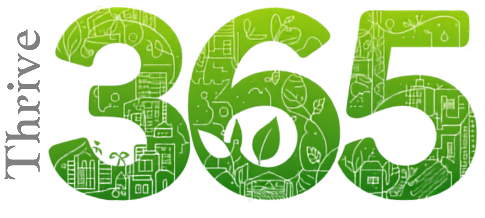

  

 
Thrive365 is a web platform designed to promote sustainable living and environmental responsibility in Burgas. Through daily eco-friendly challenges, gamification, and community engagement, users are encouraged to adopt greener habits and contribute to a more sustainable city.

The platform rewards users with points and achievements for completing activities such as recycling, reducing waste, and choosing environmentally friendly transportation. It also features an interactive map that highlights safe and eco-friendly routes, parks, recycling stations, cycling infrastructure, and public transport options.

By combining technology, education, and incentives, Thrive365 helps citizens make a positive environmental impact while working together towards a cleaner and greener Burgas.

<h2>Key Features</h2>

+ Daily eco-friendly challenges 
+ Points, achievements, and rewards system 
+ Interactive green map of Burgas 
+ Recycling spots and sustainable transport information 
+ Community challenges 
+ Personal impact tracking 
+ Educational sustainability content 

<h2>Technologies Used</h2>

+ Python
+ Flask
+ Werkzeug
+ SQLAlchemy
+ SQLite
+ Qwen
+ Ollama

<h2>Our Team</h2>

| Name | Role |
|------|------|
| [**Antonio Ivanov**](https://github.com/AIIvanov24) | Back-End Developer |
| [**Iveta Noneva**](https://github.com/IHNoneva24) | Designer |
| [**Galin Enev**](https://github.com/GKEnev24) | Front-End Developer |
| [**Valeri Tenev**](https://github.com/VATenev23) | Back-End Developer |
| [**Aleksandar Georgiev**](https://github.com/AVGeorgiev23) | Back-End Developer |

<h2 align="center"></h2>
Made with ❤️ by us.
